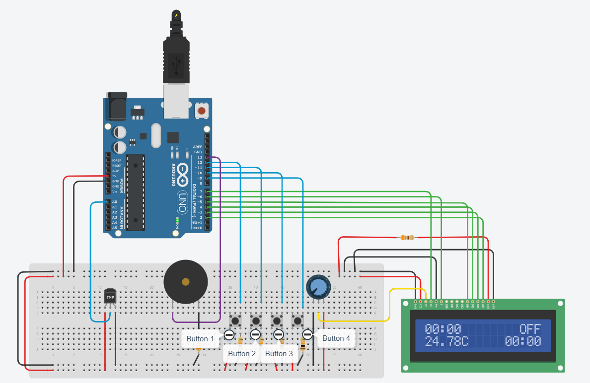

# digitalAlarmClock
Digital Alarm Clock developed on ATmega328, can be simulated on TinkerCad platform.

TinkerCad: https://www.tinkercad.com/things/eqmYaAKFV9U-digital-alarm-clock

## Circuit and connections

The circuit is built by using an Arduino Uno, 1 16x2 LCD, 4 buttons, 1 piezo buzzer and 1 TMP36 
temperature sensor. Only library that has been included is “LiquidCrystal.h”.

LCD connections to Arduino are RS for pin 7, E for pin 6, DB4 for pin 5, DB3 for pin 4, DB2 for 
pin 3, DB1 for pin 2 respectively. Also a 330Ω resistor is added from LED Anode to 5V rail and a 10kΩ 
potentiometer to V0 pin of LCD. Four buttons are connected as pull-down using 10kΩ resistors. 
They are connected to pins 12, 11, 10, 9 of Arduino respectively. A piezo buzzer is connected to 
Pin 13 and also it is connected to ground using 330Ω resistor. Finally a TMP36 temperature sensor 
is used and it is connected to A0 pin of Arduino.

## Code breakthrough

Several functions are added to perform different tasks. The code starts by defining various variables 
for button pins, button states, button timers, buzzer and temperature sensor pins and boolean variables 
indicating if a functionality is enabled or not such as Celsius or Fahrenheit, AM/PM format or 
24 hour format and is alarm on or off.

- ### Setting up timer1 registers for interrupt

The timer1 of Arduino is used for timing. In setup function, TCCR1A, TCCR1B and
TIMSK1 registers are used to set up the timer and enabling timer interrupt. By enabling
corresponding bits in register, timer1 is used in CTC mode with a top value OCR1A=15624. The
prescaling is set to 1024 by enabling corresponding registers in TCCR1B. OCIE1A bit is set in
TIMSK1 register in order to activate timer1 COMPA interrupt. Lastly, by setting up an ISR for
timer1 COMPA, an interrupt is generated every second. This way, the seconds can be updated by
using the timer1 of Arduino.

- ### setupAlarm and setupClock functions

The setupAlarm and setupClock functions are used to set the corresponding time. They are called when 
the corresponding buttons are hold for 3 seconds. Also setting up hour and minute functions are 
separated so that with a short button click, the set up parameter is changed.

- ### updateClock and printClock functions

The updateClock function is used to update the time and increment the second variable. The printClock 
function is used to first check if AM/PM mode is enabled or not and then print current time to LCD. 
The printClock function is also called in updateClock function so that only updateClock is used to 
both update and print the time. Then the updateClock function is called in timer ISR, so that time is 
updated every second.

- ### calculateTemperature and updateTemperature functions

In the calculateTemperature function, first an analog read is performed on sensor pin. Then this value is 
assigned to corresponding Celsius value by converting read millivolt data to Celsius. Also in this function 
Fahrenheit conversion is performed if Fahrenheit mode is enabled. Then in updateTemperature function, the 
temperature value is printed to LCD and also a letter is printed indicating the value is Celsius or Fahrenheit. 
The updateTemperature function is also called in calculateTemperature, so that with only one function 
call, the temperature conversion and printing is done. The calculateTemperature function is also called in ISR 
so that it can be updated every second.

- ### alarmIndicator, alarmTime and alarmSnooze functions

The alarmIndicator function shows the alarm is ON or OFF. Also the alarmTime function shows the alarm hour 
and minute that has been set up. Also, if the alarm and clock time are equal, the buzzer is turned on and off 
as the alarm ringing sound. The alarmSnooze function checks the state of isAlarmOff and if alarm is set, it 
is going to snooze the alarm for 5 minutes.

- ### handleButtonX functions

There are four handleButtonX functions created. In these functions, a digital reading is performed and decided 
that if the button is not pressed, if the button is short pressed or if the button is long pressed. Then, the 
corresponding statements are done inside the handleButtonX function depending on the press is short or long and 
previous boolean values. These handleButtonX functions are called in loop function continuously.

## Button usage

A short press for button 1 changes the state of 12/24 hour mode when no setup mode is active. 
If clock setup mode is active, button 1 acts as the apply button for setting up clock minute and hour. 
A long press for button 1 enters the clock setup. 

A short press for button 2 changes thestate of alarm indicating on or off when no setup mode is active. 
If alarm setup mode is active, button 2 acts as the apply button for setting up alarm minute and hour. 
A long press for button 2
enters the alarm setup. 

A short press for button 3 changes between Celsius and Fahrenheit if no setup mode is active. 
If any setup mode is active the button 3 acts as the raise button. 
There is no long press implemented in for this button because it is not needed. 

A short press for button 4 activates the snooze function. This is the only function of button 4. 
There is no long press implemented for this button because it is not needed.

## Setup and usage of digital alarm clock

The default starting time for both clock and alarm are 00:00. The user can set both clock
and alarm by using the buttons as described above. When setting up the clock, a text pops up in
LCD’s first line as “C.Set” indicating that user is in clock setup mode. Also when setting up the
alarm, a text appears as “A.Set” indicating that user is in alarm setup mode. When the user exists
any setup mode, the message disappears and digital clock continues it’s normal operation. Also,
when both clock and alarm setups are set, the second variable returns to zero.

So for example, if the clock is set to 10:14 and alarm is set to 10:15, once the both setups are complete, 
exactly 60 seconds needs to pass in order to ring the alarm.

### Function placements on LCD

On top left the clock is shown, on top right there is an indication showing alarm is on or off. 
On bottom left temperature is shown and on bottom right the alarm is shown.

> There is a small delay introduced in loop function, because otherwise the Tinkercad platform cannot keep up in speed. 
If delay is not used in loop function the simulation time decreases drastically. This delay function is only used 
for this purpose, it is not related to any timing.
